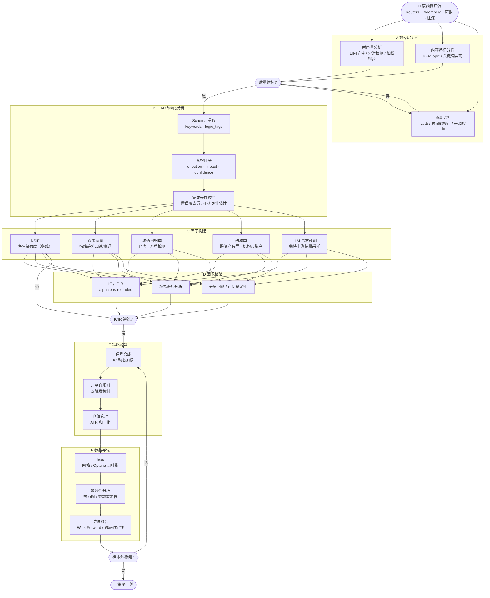
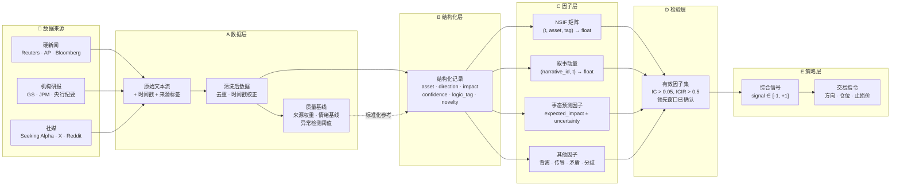
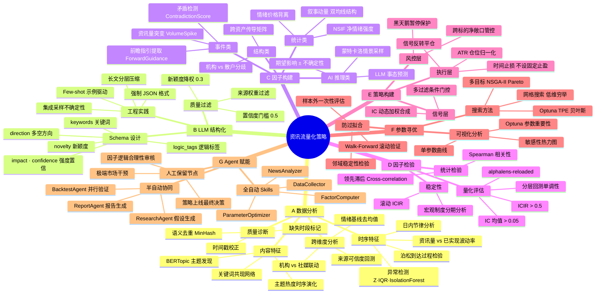

# 资讯流驱动的外汇与贵金属量化策略构建实践

> **标的**：G10 外汇 + XAU/XAG 贵金属
> **定位**：从原始新闻到可交易信号的完整工程链路
> **摘要**：本文系统梳理基于资讯流构建量化策略的六步框架——数据分析、LLM结构化提取、因子构建、因子检验、策略构建、参数寻优，重点呈现工程实践细节，适合有一定量化背景的研究员参考。

---

## 全流程概览

```
[原始资讯流]
     │
     ▼ A. 数据层分析
 时序分布 / 内容特征 / 质量诊断 / 跨维度关联
     │
     ▼ B. LLM 结构化分析
 keywords / logic_tags / direction / impact / confidence
     │
     ▼ C. 因子构建
 NSIF / 叙事动量 / 矛盾检测 / 跨资产传导 / LLM事态预测 ...
     │
     ▼ D. 因子检验
 相关性 / 领先滞后 / IC·ICIR / 分层回测 / 稳定性
     │
     ▼ E. 策略构建
 信号合成 / 开平仓规则 / 仓位管理 / 风控体系
     │
     ▼ F. 参数寻优
 网格搜索 / 贝叶斯优化 / 敏感性可视化 / 过拟合防控
```

---

---

## 可视化：流程图 / 数据流图 / 思维导图

### 整体流程图



---

### 数据流图



---

### 思维导图



---

## A. 数据层分析

在做任何建模之前，必须系统性地理解数据集本身的形态。资讯流数据与价格序列有本质区别——它是非结构化、非等间距、噪声高度混杂的文本时序，其分布特征直接决定后续因子的设计逻辑。

### A.1 时序量特征分析

**基础分布统计**

```python
# 按小时/日统计各来源资讯量
vol = df.groupby(['source', pd.Grouper(key='timestamp', freq='1H')])['id'].count()

# 基础统计描述
print(vol.describe())  # mean, std, min, max, percentiles
print(vol.skew())      # 偏度：资讯量通常高度右偏
print(vol.kurt())      # 峰度：尾部事件频率
```

**日内节律分析**

外汇和贵金属市场存在明显的交易时段效应，资讯量同步呈现日内周期：

```python
# 提取小时效应
df['hour'] = df['timestamp'].dt.hour
hourly_avg = df.groupby('hour')['id'].count() / n_days

# 典型模式：亚洲盘（08-10 UTC+8）→ 欧洲盘（15-17 UTC+8）→ 美洲盘（21-23 UTC+8）
# 关注各时段的资讯量基线差异，用于信号标准化
```

**资讯量异常检测**

尖峰资讯量是事件驱动行情的重要前兆信号：

```python
# Z-Score 检测（适合正态分布假设）
z_score = (vol - vol.mean()) / vol.std()
spike_mask_z = z_score > 3

# IQR 方法（对偏态分布更鲁棒）
Q1, Q3 = vol.quantile(0.25), vol.quantile(0.75)
spike_mask_iqr = vol > Q3 + 3 * (Q3 - Q1)

# Isolation Forest（捕捉多维特征的复合异常）
from sklearn.ensemble import IsolationForest
features = pd.DataFrame({'volume': vol, 'hour': df['hour'], 'weekday': df['weekday']})
iso = IsolationForest(contamination=0.02).fit(features)
anomaly_mask = iso.predict(features) == -1
```

**与市场波动率的联动分析**

```python
# 资讯量 vs 已实现波动率（RV）的相关性
rv = price_returns.rolling(window).std() * np.sqrt(252 * 24)
corr_vol_rv = vol.corr(rv)

# 滚动相关性：观察联动强度是否随市场制度变化
rolling_corr = vol.rolling(30 * 24).corr(rv)
```

**信息到达间隔分析**

检验资讯流是否符合泊松过程假设（即到达间隔呈指数分布），这影响因子的时间建模方式：

```python
inter_arrival = df['timestamp'].diff().dt.total_seconds()
# Q-Q图检验是否为指数分布
# 若显著偏离泊松过程 → 存在丛发效应（信息爆发），需考虑Hawkes过程建模
from scipy import stats
stats.kstest(inter_arrival.dropna(), 'expon', args=(inter_arrival.mean(),))
```

### A.2 内容特征分析

**主题分布与演化（Topic Modeling）**

```python
# BERTopic：基于 Transformer 的主题发现，语义质量优于 LDA
from bertopic import BERTopic
model = BERTopic(language='multilingual', min_topic_size=20)
topics, probs = model.fit_transform(news_summaries)
model.get_topic_info()  # 查看各主题的代表词

# 追踪主题热度随时间的变化
topics_over_time = model.topics_over_time(docs, timestamps)
model.visualize_topics_over_time(topics_over_time)
```

**关键词词频与共现分析**

```python
from collections import Counter
from itertools import combinations

# 词频统计（按来源 / 标的分组）
all_keywords = [kw for kws in df['keywords'] for kw in kws]
freq = Counter(all_keywords).most_common(50)

# 共现网络：识别关键词的语义邻域（例如 "inflation" 常与哪些词共现？）
pairs = [pair for kws in df['keywords'] for pair in combinations(kws, 2)]
cooccurrence = Counter(pairs)
# 可视化为网络图，用于理解市场叙事的结构
```

**来源可信度评估**

```python
# 回测各来源历史资讯对应方向的准确率（以 N 小时后价格方向为标准）
for source in df['source'].unique():
    subset = df[df['source'] == source]
    accuracy = (subset['direction'] == subset['future_direction_label']).mean()
    source_weights[source] = accuracy  # 用于后续因子加权
```

**资讯重复率与信息增量**

```python
from sentence_transformers import SentenceTransformer, util

model = SentenceTransformer('all-MiniLM-L6-v2')
embeddings = model.encode(df['content'].tolist(), batch_size=64)

# 计算每条资讯与前 N 条的最大余弦相似度
for i in range(len(embeddings)):
    window = embeddings[max(0, i-20):i]
    if len(window):
        sim = util.cos_sim(embeddings[i], window).max().item()
        df.loc[i, 'novelty'] = 1 - sim  # novelty = 1 - 最大相似度
```

### A.3 跨维度关联分析

**资讯情绪基线（Sentiment Baseline）**

各标的的情绪并非天然中性，长期可能存在偏多或偏空的系统性偏差。在构建 NSIF 之前需先确认并去除情绪基线：

```python
# 计算各标的、各 logic_tag 的长期平均情绪（作为基线）
baseline = df.groupby(['asset', 'logic_tag'])['signed_impact'].mean()

# 去均值后的情绪信号才是真正的"超额情绪"
df['demeaned_impact'] = df['signed_impact'] - df.apply(
    lambda r: baseline.get((r['asset'], r['logic_tag']), 0), axis=1
)
```

**不同来源的情绪一致性分析**

```python
# 同一时段内，机构媒体 vs 社媒的情绪方向是否一致？
institutional = df[df['source_type'] == 'institutional'].groupby('hour')['direction'].mean()
social        = df[df['source_type'] == 'social'].groupby('hour')['direction'].mean()

divergence = institutional - social
# 高分歧时段往往是信噪比最高的机会窗口（机构 vs 散户情绪背离）
```

### A.4 数据质量诊断

| 质量问题 | 检测方法 | 处理方式 |
|----------|----------|----------|
| 时间戳错误（抓取时间 ≠ 发布时间） | 对比多来源同一事件的时间差分布 | 以最早报道时间为准 |
| 语义重复 | 余弦相似度 > 0.85 | 保留最早版本，后续赋予低 novelty |
| 标的关联噪声 | 回测各标的的情绪-价格相关性 | 过滤长期相关性极低的关联 |
| 缺失时段 | 检测连续空窗 > 2h（非节假日） | 标记缺失区间，禁止该区间产生信号 |
| 异常来源 | 来源历史准确率 < 0.45 | 降权或剔除 |

> **Step A 的核心产出**：各维度历史分布基线 + 异常检测阈值 + 来源可信度权重，为后续因子构建提供标准化基础。

---

## B. LLM 结构化分析

### B.1 输出 Schema 设计

每条资讯经 LLM 分析后输出以下结构化记录：

```json
{
  "news_id": "uuid",
  "timestamp": "2026-03-25T08:30:00Z",
  "source": "Reuters",
  "keywords": ["Fed", "rate cut", "inflation", "labor market"],
  "logic_tags": ["monetary_policy", "macro_data"],
  "assets": {
    "EURUSD": {
      "direction": -1,
      "impact": 0.72,
      "confidence": 0.85,
      "reasoning": "Fed鹰派表态强化美元，EUR/USD承压"
    },
    "XAUUSD": {
      "direction": -1,
      "impact": 0.60,
      "confidence": 0.78,
      "reasoning": "实际利率上升预期压制黄金"
    }
  },
  "event_importance": 0.90,
  "novelty": 0.65,
  "narrative_id": "fed_rate_path_2026q1"
}
```

`logic_tags` 分类体系：

| 标签 | 典型资讯 | 主要影响标的 |
|------|----------|-------------|
| `monetary_policy` | 央行决议、官员讲话、利率预期 | 全部 G10 货币对 |
| `macro_data` | GDP、CPI、NFP、PMI | 相关货币对 |
| `geopolitics` | 地缘冲突、制裁、外交事件 | XAU/XAG、避险货币 |
| `risk_sentiment` | 股市波动、VIX、市场情绪 | JPY、CHF、XAU |
| `energy_commodity` | 油价、大宗商品 | CAD、NOK、XAG |
| `fiscal_policy` | 财政刺激、债务上限 | USD 相关 |
| `positioning_flow` | 机构持仓、资金流向 | 全部标的 |

### B.2 Prompt 工程要点

**① Few-shot 示例驱动**

为每种 `logic_tag` 准备 2~3 条标注示例，覆盖边界情形（如模糊的官员表态、前后矛盾的研报结论）。

**② 强制结构化输出**

```python
response = client.chat.completions.create(
    model="gpt-4o",
    response_format={"type": "json_object"},
    messages=[{"role": "user", "content": prompt}]
)
# 或使用 Function Calling，显式约束字段类型和范围
```

**③ 分层提示策略**

对长文研报先压缩摘要再做结构化分析：

```
[长文研报] → Summarize Agent（提取结论段）→ Extract Agent（结构化打分）
```

**④ 置信度校准（Platt Scaling）**

LLM 的自评 `confidence` 系统性偏高，需用历史数据校准：

```python
from sklearn.calibration import CalibratedClassifierCV
# 以历史"LLM预测方向 == 实际价格方向"为标签，校准置信度分数
calibrated_conf = platt_scale(raw_confidence, historical_accuracy)
```

**⑤ 集成采样（Ensemble Sampling）**

对同一条重要资讯多次采样（temperature > 0），用输出方差作为不确定性估计：

```python
directions = [llm_analyze(news, temperature=0.7) for _ in range(5)]
mean_direction = np.mean(directions)
uncertainty = np.std(directions)   # 方差大 → 该资讯解读存在歧义
```

### B.3 资讯质量过滤

| 过滤条件 | 阈值 | 处理 |
|----------|------|------|
| LLM 置信度 | < 0.5 | 丢弃 |
| 集成采样标准差 | > 0.4 | 降权至 50% |
| 资讯新颖度 | < 0.3 | 降权（已被消化） |
| 来源可信度权重 | < 0.4 | 丢弃 |

> **Step B 的核心产出**：`(timestamp, asset, direction, impact, confidence, logic_tag, narrative_id)` 结构化原材料表。

---

## C. 因子构建

基于 Step B 的结构化数据，提供多条因子构建路径，覆盖从统计加权到 AI 推理的不同维度。

---

### C.1 净情绪强度因子（NSIF）

**NSIF（Net Sentiment Intensity Factor）** 是基础量化因子，衡量某时间窗口内特定标的在特定逻辑维度上的综合多空情绪强度。

**公式（带时间衰减）**：

$$\text{NSIF}(t,\ \text{asset},\ \text{tag}) = \frac{\displaystyle\sum_{i \in \mathcal{N}} \text{dir}_i \cdot \text{impact}_i \cdot \text{conf}_i \cdot w_{\text{src},i} \cdot e^{-\lambda_{\text{tag}}(t - t_i)}}{\displaystyle\sum_{i \in \mathcal{N}} e^{-\lambda_{\text{tag}}(t - t_i)}}$$

**时间衰减系数**（按资讯类型差异化设置）：

| 资讯类型 | 典型半衰期 | 备注 |
|----------|-----------|------|
| 硬数据（NFP、CPI、央行决议） | 1–4 小时 | 市场反应极快 |
| 官员非正式讲话 | 4–24 小时 | 需时间解读 |
| 地缘政治事件 | 12–72 小时 | 演化型风险 |
| 机构研报 / 宏观分析 | 3–7 天 | 中长期方向 |

**多维度 NSIF 矩阵**：按 `logic_tag` 拆分，避免不同逻辑方向的情绪相互抵消：

```
NSIF_monetary_policy(t, EURUSD)   NSIF_geopolitics(t, XAUUSD)
NSIF_risk_sentiment(t, USDJPY)    NSIF_macro_data(t, GBPUSD)
...
```

---

### C.2 叙事动量因子（Narrative Momentum）

NSIF 衡量的是情绪的截面强度，而叙事动量捕捉的是**同一主题叙事随时间的加速或衰退**——这往往领先于 NSIF 的方向转变。

```python
# narrative_id 由 Step B 中的语义聚类分配
# 每个叙事的情绪强度时序
narrative_sentiment = df.groupby(['narrative_id', pd.Grouper(key='timestamp', freq='4H')])['signed_impact'].mean()

# 动量 = 短期均值 - 长期均值（类似 MACD 的双均线差）
short_ma = narrative_sentiment.rolling(6).mean()   # 24小时
long_ma  = narrative_sentiment.rolling(18).mean()  # 72小时
narrative_momentum = short_ma - long_ma

# 正值：叙事情绪在加速升温（趋势跟随信号）
# 快速从正转负：叙事反转（均值回归信号）
```

---

### C.3 情绪-价格背离因子（Sentiment-Price Divergence）

当资讯情绪持续改善但价格未跟随，或情绪恶化但价格未下跌时，往往预示着均值回归机会：

```python
# 滚动相关性：NSIF 与价格收益率的近期协同程度
rolling_corr = nsif.rolling(48).corr(price_return.rolling(48))

# 背离信号：相关性显著低于历史均值
divergence_z = (rolling_corr - rolling_corr.rolling(200).mean()) / rolling_corr.rolling(200).std()

# divergence_z << -2 时：情绪与价格背离，潜在均值回归
```

---

### C.4 资讯量突变因子（Volume Spike）

资讯量的异常爆发本身就是独立的信号维度，独立于情绪方向：

```python
volume_spike = news_count_1h / rolling_mean_30d

# 用途一：趋势加速信号（量增价涨 → 动能延续）
# 用途二：波动率预警（量增但方向不明 → 扩大止损）
# 用途三：黑天鹅保护（spike > 10σ → 暂停开仓）
```

---

### C.5 机构 vs 散户情绪分歧因子

机构研报与社媒的情绪方向分歧，是一类高质量的反向或跟随信号：

```python
inst_sent   = df[df['source_type']=='institutional'].groupby(['asset','hour'])['signed_impact'].mean()
retail_sent = df[df['source_type']=='social'].groupby(['asset','hour'])['signed_impact'].mean()

divergence = inst_sent - retail_sent
# 正值大：机构偏多 + 散户偏空 → 反向做多散户（跟随机构）
# 负值大：机构偏空 + 散户偏多 → 与机构同向做空
```

---

### C.6 矛盾检测因子（Contradiction Signal）

新旧资讯之间存在语义矛盾时，代表市场观点分歧加大，往往预示波动率上升或即将的方向选择：

```python
# 计算最新资讯与过去 24h 同 logic_tag 资讯的语义相似度 & 方向一致性
recent_direction = nsif_recent.sign()
new_direction    = new_news['direction']

contradiction_score = abs(recent_direction - new_direction) / 2
# 0 = 完全一致，1 = 完全相反

# 高矛盾分 + 高 event_importance → 观点转折信号，适合减仓等待
```

---

### C.7 跨资产叙事传导因子

G10 外汇与贵金属之间存在结构性的情绪传导关系，可以显式建模：

```python
# 传导矩阵（基于历史回测确定）
transmission_matrix = {
    'USD_sentiment':  {'EURUSD': -1, 'USDJPY': +1, 'XAUUSD': -0.7, 'XAGUSD': -0.5},
    'RISK_OFF':       {'USDJPY': -1, 'USDCHF': -0.8, 'XAUUSD': +1},
    'INFLATION_UP':   {'XAUUSD': +0.8, 'XAGUSD': +0.6, 'EURUSD': -0.3},
}

# 当 USD 情绪信号出现时，自动生成相关标的的传导因子
for target, weight in transmission_matrix['USD_sentiment'].items():
    transmitted_factor[target] = USD_nsif * weight
```

这种传导因子的价值在于：即使某个标的的直接资讯覆盖稀少，也能通过关联资产的信号获得补充。

---

### C.8 前瞻性指引提取因子（Forward Guidance）

专门针对央行沟通，提取含有明确前瞻指引的表述，这类信号的持续有效期通常超过普通资讯：

```python
# 识别前瞻性指引关键词模式
forward_guidance_patterns = [
    "we expect", "we anticipate", "in coming meetings",
    "data dependent", "stand ready to", "remain restrictive for longer"
]

# 含前瞻指引的资讯，衰减系数 λ 设置更小（持续有效期更长）
if news['has_forward_guidance']:
    lambda_override = lambda_guidance  # 比普通资讯慢 3-5 倍衰减
```

---

### C.9 LLM 事态预测因子

路径 C.1~C.8 本质上是对历史情绪的统计汇总，而 LLM 事态预测尝试让模型基于事件发展逻辑，对**未来事态走向**做出判断。

**整体流程**：

```
结构化资讯 → 主题聚类 → 时间线整理 → LLM第一性原理推演 → 蒙特卡洛情景采样 → 概率加权预测因子
```

**① 主题聚类与时间线整理**

```python
embeddings = embed_model.encode(news_list['summary'])
clusters = HDBSCAN(min_cluster_size=5).fit(embeddings)

for cluster_id in unique_clusters:
    timeline = news_df[news_df.cluster == cluster_id].sort_values('timestamp')
```

**② LLM 第一性原理推演**

```
输入：叙事时间线摘要 + 当前市场背景
输出：
  1. 当前叙事的关键驱动因子
  2. 三种情景（乐观/基准/悲观）及各自概率
  3. 每种情景下对目标标的的方向和幅度预测
  4. 该叙事预计被 price-in 的时间窗口
```

**③ 蒙特卡洛情景采样**

```python
scenarios = {
    'bullish': {'prob': 0.25, 'impact': +0.8},
    'base':    {'prob': 0.55, 'impact': -0.3},
    'bearish': {'prob': 0.20, 'impact': -0.9},
}
samples = np.random.choice(
    [s['impact'] for s in scenarios.values()],
    p=[s['prob'] for s in scenarios.values()],
    size=10000
)
expected_impact = samples.mean()   # 方向因子
impact_std = samples.std()         # 不确定性（用于仓位折扣）
```

---

### C.X 因子全景概览

| 因子 | 类型 | 信号频率 | 核心逻辑 |
|------|------|---------|---------|
| NSIF | 统计加权 | 高频（小时级） | 情绪强度截面汇总 |
| 叙事动量 | 时序动量 | 中频（4h级） | 情绪趋势加速/衰退 |
| 情绪-价格背离 | 均值回归 | 中频 | 情绪与价格脱节 |
| 资讯量突变 | 事件驱动 | 事件触发 | 波动率预警 |
| 机构 vs 散户分歧 | 对比 | 中频 | 信息优势方向 |
| 矛盾检测 | 结构变化 | 事件触发 | 观点转折 |
| 跨资产传导 | 结构建模 | 高频 | 关联资产补充信号 |
| 前瞻指引提取 | 事件专项 | 低频 | 央行信号长效持续 |
| LLM事态预测 | AI推理 | 低频（日级） | 叙事演化方向预判 |

---

## D. 因子检验

### D.1 相关性分析

```python
for horizon in [1, 4, 8, 24]:
    future_return = price.pct_change(horizon).shift(-horizon)
    corr = stats.spearmanr(nsif.dropna(), future_return.dropna())
    print(f"Horizon={horizon}h: corr={corr.statistic:.3f}, p={corr.pvalue:.4f}")
```

### D.2 领先滞后分析（Lead-Lag）

```python
lags = range(-12, 13)
cross_corr = [nsif.corr(future_return.shift(lag)) for lag in lags]
# 正 lag 时相关性最高 → 因子领先价格
# 负 lag 最大 → 价格已提前跑完，因子是滞后指标
```

### D.3 IC / ICIR 检验

```python
def calc_ic(factor_df, return_df, horizon=24):
    ic_series = []
    for t in factor_df.index:
        f = factor_df.loc[t]
        r = return_df.shift(-horizon).loc[t]
        ic = f.corr(r, method='spearman')
        ic_series.append(ic)
    ic = pd.Series(ic_series, index=factor_df.index)
    return ic.mean(), ic.std(), ic.mean() / ic.std()

# 推荐工具：alphalens-reloaded（Quantopian 维护的因子分析标准库）
import alphalens
factor_data = alphalens.utils.get_clean_factor_and_forward_returns(factor, prices, periods=[4, 8, 24])
alphalens.tears.create_full_tear_sheet(factor_data)
# 输出：IC 时序、IC 分布、因子分层收益、换手率、衰减分析
```

### D.4 分层回测

```python
factor_quintiles = pd.qcut(nsif, q=5, labels=['Q1','Q2','Q3','Q4','Q5'])
grouped_returns = return_df.groupby(factor_quintiles).mean()
# 期望单调性：Q5 > Q4 > Q3 > Q2 > Q1
# 核心指标：多空组合（Q5 - Q1）的夏普比率
```

### D.5 时间稳定性检验

```python
rolling_icir = ic_series.rolling(252).apply(lambda x: x.mean() / x.std())
# 若某段 ICIR 大幅为负，分析是否为制度切换（加息/降息周期转换）
```

---

## E. 策略构建

### E.1 信号合成

将多维因子加权合成为单一交易信号，权重由滚动历史 IC 动态更新：

```python
# IC 加权（负 IC 因子截断为 0，避免反向因子拖累）
ic_weights = {factor: max(ic_series[factor].rolling(60).mean(), 0)
              for factor in factors}
w_sum = sum(ic_weights.values())
w_normalized = {k: v / w_sum for k, v in ic_weights.items()}

signal = sum(w_normalized[f] * factor_values[f] for f in factors)
```

### E.2 开平仓规则

**开仓**

信号强度超过阈值 θ 时触发，并叠加质量过滤：

```python
if signal > theta_long:
    open_long(asset)
elif signal < -theta_short:
    open_short(asset)
```

| 过滤条件 | 目的 |
|----------|------|
| `event_importance > 0.6` | 忽略低重要性信号 |
| `VolumeSpike < 10σ` | 极端异常时暂停开仓（黑天鹅保护） |
| `contradiction_score < 0.6` | 高观点分歧时暂停 |
| 流动性时段过滤 | 仅在欧美主要时段执行 |

**平仓（双触发机制）**

```python
# 触发一：信号反转
if position == LONG and signal < -theta_exit:
    close_position()

# 触发二：时间止损（资讯有效期结束）
if holding_time > max_holding_bars:
    close_position()
```

不设固定止盈——资讯驱动行情的延续性难以预判，用信号反转替代固定止盈，让利润奔跑。

### E.3 仓位管理

```python
# 信号强度 × 不确定性折扣 × ATR 归一化
base_size         = abs(signal) * max_position
uncertainty_disc  = 1 / (1 + impact_std)         # LLM 路径不确定性折扣
atr_scalar        = target_risk / atr(asset, 14)  # 跨标的风险等额
position_size     = base_size * uncertainty_disc * atr_scalar
```

跨标的风险控制：单标的敞口不超过组合总风险的 30%；USD 相关方向需汇总净敞口。

### E.4 止损设计

```python
stop_loss = entry_price ± atr_multiple * atr(asset)  # 基于 ATR 的动态止损
```

### E.5 策略评估指标

| 指标 | 参考目标 |
|------|---------|
| 年化夏普比率 | > 1.0 |
| 最大回撤 | < 15% |
| Calmar 比率 | > 0.5 |
| 胜率 | > 45% |
| 平均盈亏比 | > 1.5 |

---

## F. 参数寻优

参数寻优的目标是找到**稳健而非最优**的参数组合——在参数空间中站得住脚的平台，而非孤立的高峰。

### F.1 参数空间定义

```python
param_grid = {
    'lambda_hard':       [0.1, 0.2, 0.35, 0.5, 0.7],
    'lambda_geo':        [0.01, 0.03, 0.05, 0.08],
    'theta_entry':       [0.2, 0.3, 0.4, 0.5],
    'theta_exit':        [0.1, 0.2, 0.3],
    'atr_multiple':      [1.0, 1.5, 2.0, 2.5],
    'max_holding_bars':  [12, 24, 48, 72],
    'confidence_floor':  [0.4, 0.5, 0.6],
}
```

### F.2 三种寻优方法对比

**方法一：网格搜索（Grid Search）**

穷举全参数空间，适合参数维度 ≤ 5、计算预算充足的场景：

```python
from itertools import product

results = []
for params in product(*param_grid.values()):
    param_dict = dict(zip(param_grid.keys(), params))
    metrics = run_backtest(param_dict, data=train_data)
    results.append({**param_dict, **metrics})

results_df = pd.DataFrame(results)
```

**方法二：贝叶斯优化（Optuna）**

在高维参数空间中更高效，在相同计算预算下通常能找到更优的参数组合：

```python
import optuna

def objective(trial):
    params = {
        'lambda_hard':      trial.suggest_float('lambda_hard', 0.05, 0.8, log=True),
        'theta_entry':      trial.suggest_float('theta_entry', 0.1, 0.6),
        'atr_multiple':     trial.suggest_float('atr_multiple', 0.5, 3.0),
        'max_holding_bars': trial.suggest_int('max_holding_bars', 6, 96),
    }
    metrics = run_backtest(params, data=train_data)
    return metrics['sharpe']   # 优化目标

study = optuna.create_study(
    direction='maximize',
    sampler=optuna.samplers.TPESampler(seed=42),          # 贝叶斯 TPE 采样
    pruner=optuna.pruners.MedianPruner(n_startup_trials=10)  # 剪枝：早停差试验
)
study.optimize(objective, n_trials=500, n_jobs=4)

# Optuna 内置可视化
optuna.visualization.plot_optimization_history(study)     # 寻优过程
optuna.visualization.plot_param_importances(study)        # 参数重要性
optuna.visualization.plot_contour(study, params=['lambda_hard', 'theta_entry'])  # 参数交叉
```

Optuna 的 `plot_param_importances` 是网格搜索热力图的替代——它能直接量化各参数对目标函数的贡献，快速定位值得精调的参数。

**方法三：多目标优化（Optuna Multi-Objective）**

不以单一最优夏普为目标，同时优化夏普和最大回撤：

```python
def multi_objective(trial):
    # ... 参数采样
    metrics = run_backtest(params, data=train_data)
    return metrics['sharpe'], -metrics['max_drawdown']  # 最大化夏普，最小化回撤

study = optuna.create_study(
    directions=['maximize', 'maximize'],
    sampler=optuna.samplers.NSGAIISampler()   # 多目标进化算法
)
study.optimize(multi_objective, n_trials=500)

# Pareto 前沿：在夏普-回撤权衡面上挑选最终参数
optuna.visualization.plot_pareto_front(study)
```

### F.3 参数敏感性可视化

**热力图：两两参数交叉**

```python
import seaborn as sns

pivot = results_df.groupby(['lambda_hard', 'theta_entry'])['sharpe'].mean().unstack()
sns.heatmap(pivot, annot=True, fmt='.2f', cmap='RdYlGn', center=1.0)
plt.title('Sharpe: lambda_hard × theta_entry')
```

**单参数敏感性曲线**

```python
fig, axes = plt.subplots(2, 4, figsize=(18, 8))
for ax, param in zip(axes.flat, param_grid.keys()):
    grouped = results_df.groupby(param)['sharpe'].agg(['mean', 'std'])
    ax.plot(grouped.index, grouped['mean'], marker='o')
    ax.fill_between(grouped.index,
                    grouped['mean'] - grouped['std'],
                    grouped['mean'] + grouped['std'], alpha=0.3)
    ax.axhline(1.0, color='red', linestyle='--', alpha=0.5)
    ax.set_title(f'Sharpe vs {param}')
```

曲线形态的解读：

| 形态 | 含义 | 操作建议 |
|------|------|---------|
| 平坦 | 参数不敏感 | 取中间值，无需精调 |
| 陡峭单调 | 参数高度敏感 | 选稳定平台区，非最高点 |
| 先升后降 | 存在最优区间 | 警惕过拟合，选平台中部 |
| 噪声剧烈 | 统计功效不足 | 扩大样本量或放宽参数范围 |

### F.4 开源评估框架推荐

资讯类外汇策略的评估，推荐以下工具链：

**因子分析**

| 工具 | Stars | 状态 | 适用场景 |
|------|-------|------|---------|
| **alphalens-reloaded** | ~440 | 活跃维护 | IC/ICIR、分层收益、因子衰减分析，量化因子评估标准工具 |

```python
import alphalens
factor_data = alphalens.utils.get_clean_factor_and_forward_returns(
    factor=nsif_series,
    prices=price_df,
    periods=[4, 8, 24],
    quantiles=5
)
alphalens.tears.create_full_tear_sheet(factor_data)
```

**策略绩效分析**

| 工具 | Stars | 状态 | 适用场景 |
|------|-------|------|---------|
| **QuantStats** | ~6500 | 活跃 | 一键生成 HTML 绩效报告，指标全面，替代 pyfolio |
| **pyfolio-reloaded** | — | 活跃 | 专业 tear sheet，含 Fama-French 归因 |
| **vectorbt** | ~6800 | 活跃 | 向量化高速回测 + 参数扫描，内置可视化 |

```python
# QuantStats：一行生成完整报告
import quantstats as qs
qs.reports.html(strategy_returns, benchmark=benchmark_returns,
                output='strategy_report.html')

# vectorbt：参数扫描示例
import vectorbt as vbt
pf = vbt.Portfolio.from_signals(
    price, entries, exits,
    size=position_sizes,
    fees=0.0002,
)
pf.stats()         # 全套绩效指标
pf.plot().show()   # 资金曲线可视化
```

**参数优化**

| 工具 | Stars | 状态 | 适用场景 |
|------|-------|------|---------|
| **Optuna** | ~18000 | 活跃 | 贝叶斯 + 进化算法，内置参数重要性分析，首选 |
| **Ray Tune** | 34000+ | 活跃 | 分布式多机并行寻优，适合计算密集场景 |
| **Hyperopt** | ~7500 | 部分活跃 | 经典贝叶斯优化，API 较 Optuna 繁琐 |

### F.5 过拟合防控

**样本外验证（Out-of-Sample）**

```
|--- Train (70%) ---|--- Validation (15%) ---|--- Test (15%) ---|
   网格/贝叶斯寻优       早停 / 参数剪枝         最终评估（只跑一次）
```

**Walk-Forward 滚动验证**

```python
window_size = 252 * 4   # 训练窗口（约1年）
test_size   = 252       # 测试窗口（约3个月）

for start in range(0, len(data) - window_size - test_size, test_size):
    train = data[start : start + window_size]
    test  = data[start + window_size : start + window_size + test_size]
    best_params = optimize(train)
    wf_metrics.append(run_backtest(best_params, test))

# 训练集 vs 测试集夏普衰减比率 > 50% 需警惕
```

**邻域稳定性检验**

```python
best = results_df.nlargest(1, 'sharpe').iloc[0]
neighbors = results_df[
    (results_df['lambda_hard'].between(best.lambda_hard * 0.8, best.lambda_hard * 1.2)) &
    (results_df['theta_entry'].between(best.theta_entry - 0.1, best.theta_entry + 0.1))
]
print(f"邻域均值 Sharpe: {neighbors['sharpe'].mean():.2f} vs 最优: {best.sharpe:.2f}")
# 若差距 > 0.3，该参数组合是"孤岛最优"，过拟合风险高
```

### F.6 实践经验

1. **敏感性 > 最优性**：稳健参数的邻域也表现良好，孤立高峰是过拟合的红旗。
2. **λ 与资讯类型绑定**：不要用单一全局衰减系数，否则在硬数据和地缘叙事之间做出错误折中。
3. **参数更新频率**：每季度根据 Walk-Forward 更新一次，每周更新几乎必然过拟合。
4. **Optuna 优先于穷举网格**：参数维度 > 4 时，贝叶斯优化在同等计算预算下覆盖更优的参数空间区域。

---

---

## G. 用 Agent 赋能策略研发

上述 A~F 六步流程中，有大量环节存在高度重复、规则明确、可标准化的工作。这正是 Multi-Agent 系统大显身手的地方——不是替代研究员，而是把研究员从机械执行中解放出来，专注于假设创意与逻辑审核。

### G.1 各环节自动化分层

| 环节 | 自动化程度 | 说明 |
|------|-----------|------|
| A 数据采集与质量分析 | **全自动** | 规则明确，DataAgent 持续运行 |
| B LLM 结构化提取 | **全自动** | 批处理流水线，质量由规则过滤 |
| C.1~C.8 统计/结构类因子 | **全自动** | 确定性计算，实时更新 |
| C.9 LLM 事态预测 | **半自动** | 叙事输入需人工确认，模拟全自动 |
| D 因子检验 | **全自动** | 检验规则明确，结果推送人工审阅 |
| E 策略逻辑设计 | **半自动** | Agent 生成候选逻辑，人工审核 |
| E 策略回测执行 | **全自动** | BacktestAgent 并行执行 |
| F 参数寻优 | **全自动** | Optuna + BacktestAgent 完全无人值守 |
| 策略监控与风控 | **全自动** | RiskAgent 实时运行 |
| 研究报告生成 | **全自动** | ReportAgent 输出结构化文档 |

---

### G.2 可 Skill 化的能力单元

Skills 是可复用的原子能力单元——封装了工具调用（代码执行）和推理逻辑（Prompt），可被 Orchestrator 按需组合调用。以下是本策略研发流程中最具复用价值的 Skills：

#### DataCollector Skill
```
输入：数据源配置（RSS URL / API Key / 爬虫规则）
输出：清洗后的原始资讯流（去重 + 时间戳校正 + 来源标签）
能力：多源订阅 · 增量更新 · 质量检测 · 异常告警
```

#### NewsAnalyzer Skill
```
输入：一条或批量原始资讯文本
输出：结构化 Schema（direction / impact / confidence / logic_tags...）
能力：LLM 结构化提取 · 置信度校准 · 集成采样 · 批处理
```

#### NSIFComputer Skill
```
输入：结构化资讯表 + 目标标的 + 时间窗口 + λ 配置
输出：NSIF 多维矩阵（asset × tag × t）
能力：时间衰减计算 · 多 logic_tag 分维输出 · 实时滚动更新
```

#### NarrativeTracker Skill
```
输入：结构化资讯流（持续输入）
输出：当前活跃叙事列表 + 每条叙事的时间线 + 叙事动量得分
能力：语义聚类 · 时间线维护 · 叙事生命周期管理 · 动量计算
```

#### ScenarioSimulator Skill
```
输入：某条叙事的时间线摘要 + 目标标的 + 预测时间窗口
输出：多情景概率分布 + expected_impact + uncertainty
能力：LLM 第一性原理推演 · 蒙特卡洛采样 · 置信区间计算
```

#### FactorValidator Skill
```
输入：因子时序 + 价格收益率 + 检验参数配置
输出：IC / ICIR / 领先滞后图 / 分层收益表 / 是否通过检验
能力：调用 alphalens-reloaded · 自动判断有效性 · 生成检验报告
```

#### BacktestRunner Skill
```
输入：策略参数配置 + 历史数据区间
输出：绩效指标（Sharpe / MaxDD / Calmar）+ 资金曲线
能力：对接内部回测框架 · 支持并行批量执行 · 调用 QuantStats 生成报告
```

#### ParameterOptimizer Skill
```
输入：参数空间定义 + 优化目标 + 计算预算
输出：最优参数组合 + 敏感性图谱 + Walk-Forward 结果
能力：Optuna 贝叶斯优化 · 多目标 Pareto · 邻域稳定性检验
```

#### RiskMonitor Skill
```
输入：当前持仓 + 实时资讯流 + 风险阈值配置
输出：实时风险评分 + 预警事件 + 减仓建议
能力：VolumeSpike 监控 · 矛盾信号检测 · 跨标的敞口计算
```

#### ReportGenerator Skill
```
输入：回测结果 + 因子检验结果 + 参数寻优结果
输出：结构化研究报告（Markdown / HTML / PDF）
能力：自动汇总 · 图表插入 · 结论提炼 · 版本归档
```

---

### G.3 多 Agent 协作架构

#### 研发态：新策略开发

```
用户输入研究方向
        │
        ▼
┌───────────────────┐
│    Orchestrator   │  ← 拆解任务、调度 Agent、汇总结果
└──────┬────────────┘
       │
   ┌───┴────────────────────────────────┐
   ▼                                    ▼
┌──────────────┐              ┌──────────────────┐
│  DataAgent   │              │  ResearchAgent   │
│              │              │                  │
│ DataCollector│              │ 生成因子假设      │
│ NewsAnalyzer │              │ NarrativeTracker │
│ (持续运行)   │              │ ScenarioSimulator│
└──────┬───────┘              └────────┬─────────┘
       │                               │
       └──────────┬────────────────────┘
                  ▼
       ┌──────────────────────┐
       │    BacktestAgent     │
       │                      │
       │ NSIFComputer         │
       │ FactorValidator      │
       │ BacktestRunner ×N    │  ← 并行跑多组参数
       │ ParameterOptimizer   │
       └──────────┬───────────┘
                  │
                  ▼
       ┌──────────────────────┐
       │    ReportAgent       │
       │ ReportGenerator      │
       │ 输出研究文档          │
       └──────────────────────┘
                  │
                  ▼
           人工 Review ← 关键审核节点
```

#### 运行态：策略实盘监控

```
┌──────────────────────────────────────────┐
│            持续运行的 Agent 集群           │
│                                          │
│  DataAgent ──→ SignalAgent ──→ RiskAgent │
│  (实时采集)    (因子+信号计算)  (风险监控) │
│                     │                   │
│                     ▼                   │
│              交易指令生成                 │
│              (人工确认 or 自动执行)        │
└──────────────────────────────────────────┘
```

---

### G.4 哪些部分最值得 Skills 化

并非所有环节都值得包装成 Skill——Skill 的价值在于**跨项目复用**和**可组合性**。以下是优先级排序：

| 优先级 | Skill | 复用场景 |
|--------|-------|---------|
| ⭐⭐⭐ | **NewsAnalyzer** | 任何基于资讯的量化策略 |
| ⭐⭐⭐ | **BacktestRunner** | 所有策略研发项目 |
| ⭐⭐⭐ | **FactorValidator** | 所有因子研究项目 |
| ⭐⭐ | **NSIFComputer** | 外汇/贵金属/大宗资讯策略 |
| ⭐⭐ | **NarrativeTracker** | 宏观叙事跟踪、主题投资 |
| ⭐⭐ | **ParameterOptimizer** | 所有有参数的策略 |
| ⭐ | **ScenarioSimulator** | 宏观事件驱动类策略专用 |
| ⭐ | **RiskMonitor** | 实盘运行阶段 |

**NewsAnalyzer、BacktestRunner、FactorValidator** 是最高优先级——它们是整个量化研究管线中最通用、最高频调用的能力，一次建设长期受益。

---

### G.5 Agent 赋能的加速效应

与传统纯人工研发路径相比，Agent 协作系统在各环节带来的效率提升：

| 环节 | 传统路径 | Agent 辅助 | 加速比 |
|------|---------|-----------|--------|
| 数据采集与清洗 | 2~3 天 | 1~2 小时 | **~20×** |
| LLM 打标（万条级） | 1 周手工 | 数小时批处理 | **~30×** |
| 因子假设生成与初筛 | 2~4 周 | 3~5 天 | **~5×** |
| 参数寻优（千组级） | 2~3 天跑网格 | 数小时（并行+Optuna） | **~8×** |
| 研究报告撰写 | 半天~1 天 | 30 分钟 | **~4×** |
| **总研发周期** | **8~12 周** | **2~3 周** | **~4~5×** |

加速的本质不仅是执行速度，更是**并行度**——多个 Agent 同时探索不同的因子假设和参数组合，而研究员只需在关键节点做决策，而不是等待每一步完成后才能开始下一步。

---

### G.6 人工保留的关键节点

Agent 化并不意味着全自动化。以下节点应始终保留人工判断：

1. **因子逻辑合理性审核**：ICIR 通过不等于逻辑合理。Agent 筛选出的因子，研究员需审查其背后的经济逻辑是否能被解释，避免统计伪因子进入策略。

2. **策略上线最终决策**：样本外绩效良好是必要条件，不是充分条件。市场微结构、流动性约束、容量限制等需人工综合判断。

3. **极端市场事件干预**：当 VolumeSpike 达到历史极端水平（黑天鹅），或宏观制度出现剧烈切换时，Agent 的历史经验失效，需人工接管。

4. **叙事质量判断**：NarrativeTracker 追踪的叙事，哪些是市场真正在定价的主叙事，哪些是噪声，最终仍需研究员的宏观判断力来甄别。

> **核心理念**：Agent 负责"执行"，研究员负责"判断"。最高效的人机协同不是让 AI 替代人，而是让人只做 AI 做不到的那一部分。

---

## 小结

| 步骤 | 核心产出 | 关键决策点 |
|------|----------|-----------|
| A. 数据分析 | 分布基线 + 异常阈值 + 来源权重 | 质量门槛、泊松过程检验 |
| B. LLM结构化 | `(asset, direction, impact, confidence)` 原材料表 | Schema 设计 + 集成采样校准 |
| C. 因子构建 | 9 类因子覆盖动量/均值回归/传导/预测 | 衰减系数 + 路径组合 |
| D. 因子检验 | 通过检验的有效因子集 | ICIR 阈值 + 领先窗口 |
| E. 策略构建 | 完整策略逻辑 | 时间止损 + 不设固定止盈 |
| F. 参数寻优 | 稳健参数组合 + 敏感性图谱 | 邻域稳定性 + Walk-Forward |
| G. Agent 赋能 | 10 类 Skill 单元 + 双模态协作架构 | NewsAnalyzer/Backtest/Validator 优先 |

> **核心认知**：资讯类策略的优势不在于比市场更快读到新闻，而在于用 AI 更准确地理解新闻的宏观含义，并将其转化为有纪律的量化交易行为。

---

## v2.0 补充：通胀传导路径因子（2026-04-13 市场实证驱动）

> **实证依据**：2026-04-13 市场出现反直觉信号——VIX +10.19%（强风险规避），黄金同日 -0.91%，而原油 +6.30%。这证明"战争期间地缘叙事 ≠ 黄金多头"，当通胀传导叙事主导时，黄金与原油产生反向走势。本节提供新的因子类型和机制识别框架。

### H. 新因子类型：通胀传导路径因子（InflationPath Factor）

在 C 节的 9 类因子之外，新增以下因子，专门捕捉"供应冲击→通胀→利率"传导链：

#### H.1 RHFI（Rate Hike Fear Index，加息恐惧指数）

```python
# RHFI 从路透社新闻流实时计算
RHFI_components = {
    "rate_hike_mentions":   # "rate hike", "hawkish", "CPI", "tightening"
    "inflation_surprise":   # "higher than expected", "inflation spike"
    "oil_supply_shock":     # "Hormuz", "blockade", "supply disruption"
    "fed_commentary":       # "Fed may be forced to", "inflation target at risk"
}

# 正向（加息恐惧方向，压制黄金）
RHFI_pos = Σ (pos_signals × source_weight × exp(-λ_rate × Δt))

# 负向（降息预期，支撑黄金）
RHFI_neg = Σ (neg_signals × source_weight × exp(-λ_rate × Δt))

RHFI = (RHFI_pos - RHFI_neg) / normalizer  # 范围 [-1, +1]
# λ_rate 衰减半衰期 = 4h（利率预期变化比地缘政治预期更快）
```

**RHFI → 资产方向映射**：

| RHFI | 黄金方向 | 原油方向 | USD 方向 | CAD 方向 |
|------|---------|---------|---------|---------|
| > 0.5 | **空头**（加息压制）| 多头（通胀受益）| 多头（Fed 鹰派）| 多头（商品）|
| 0.2~0.5 | 中性 | 中性偏多 | 中性 | 中性偏多 |
| < 0.2 | 多头（降息预期）| 中性 | 空头 | 中性 |

#### H.2 EnergyImportStress（能源进口国压力指数）

捕捉"油价高位→能源进口国经常账户恶化→货币承压"的传导：

```python
# 针对 EUR/JPY 等能源进口货币
EIS_t = oil_price_change_30d × energy_import_sensitivity[currency]
# 日本：energy_import_sensitivity = 0.85（高度依赖）
# 欧洲：energy_import_sensitivity = 0.65
# 美国：energy_import_sensitivity = -0.30（现为净出口国）
# 加拿大：energy_import_sensitivity = -0.70（出口国）

# EIS > threshold → 做空该货币（vs USD）
```

#### H.3 油价-通胀-央行传导速度模型

不同类型的通胀新闻对央行政策的传导速度不同：

| 新闻类型 | 传导至 CPI 周期 | 传导至 Fed 政策周期 | 对黄金的影响窗口 |
|---------|--------------|-----------------|---------------|
| 油价初始冲击 | 即时 PPI 影响 | 6-12 个月 | 短期中性→中期偏空 |
| CPI 数据公布（高于预期）| 已发生 | 1-3 个月 | 立即偏空 |
| Fed 官员发言（鹰派）| 政策信号 | 0-2 个月 | 立即偏空 |
| 核心 PCE 超预期 | 最关键指标 | 0-1 个月 | 最强偏空信号 |

**LLM 提取任务**：对每条通胀/央行相关新闻，标注：
- `transmission_stage`：处于传导链的哪个阶段（oil/ppi/cpi/fed/market）
- `surprise_magnitude`：与市场预期的偏差（-1 到 +1）
- `timeline_to_rate_change`：预估距离下次加息的时间（months）

### I. 机制识别器（Regime Classifier）：核心新增模块

这是 v2.0 最重要的新模块。在所有因子计算之前，先对当前市场机制进行识别：

```python
# 每 15 分钟运行一次
regime = LLM.classify_current_regime(
    recent_news=last_15min_reuters,
    market_context={
        "gold_1h_change": ...,
        "oil_1h_change": ...,
        "vix_level": ...,
        "treasury_yield_10y": ...
    }
)

# 可能输出：
# "GEOPOL_PANIC"   → 传统避险模式（战争=买金）
# "OIL_INFLATION"  → 通胀传导模式（当前2026-04-13状态）★
# "DEESCALATION"   → 缓和模式
# "RECESSION_FEAR" → 衰退模式（油↓金↑）
# "MIXED"          → 混合机制（谨慎、降低仓位）
```

**机制识别的黄金准则**：
- 当 VIX 急涨而黄金同时下跌 → 强烈确认 `OIL_INFLATION` 机制
- 当 VIX 急涨而黄金同时上涨 → 确认 `GEOPOL_PANIC` 机制
- 两者背离幅度越大，机制信号越强

### J. B 节 LLM 结构化分析 Schema 更新

在原有 schema 基础上，新增 `regime_pathway` 字段：

```json
{
  "keywords": [...],
  "logic_tags": ["geopolitical_escalation", "energy_supply_shock", "inflation_expectation"],
  "regime_pathway": "OIL_INFLATION",     // ← 新增字段
  "rate_hike_signal": 0.7,               // ← 新增字段（-1到+1）
  "oil_supply_impact": 0.8,              // ← 新增字段（0到1）
  "transmission_stage": "oil_shock",     // ← 新增字段
  "assets": [
    {"name": "XAU/USD", "direction": -1, "impact": 0.6, "mechanism": "rate_hike_fear"},
    {"name": "CL=F",    "direction": +1, "impact": 0.9, "mechanism": "supply_disruption"},
    {"name": "USD/CAD", "direction": -1, "impact": 0.7, "mechanism": "oil_cad_linkage"}
  ]
}
```

---

*作者：VibeBloging | 标签：量化投研、资讯流策略、NLP、NSIF、Optuna、alphalens、外汇、贵金属*
